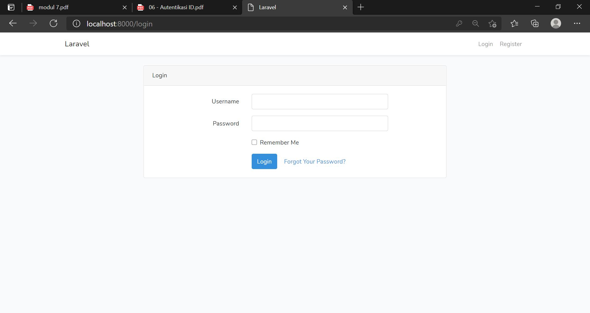
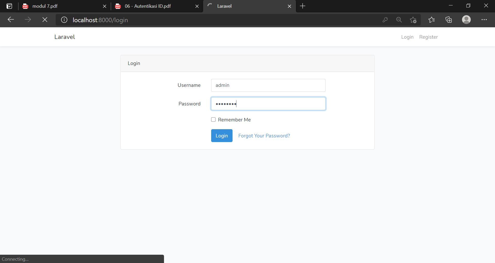
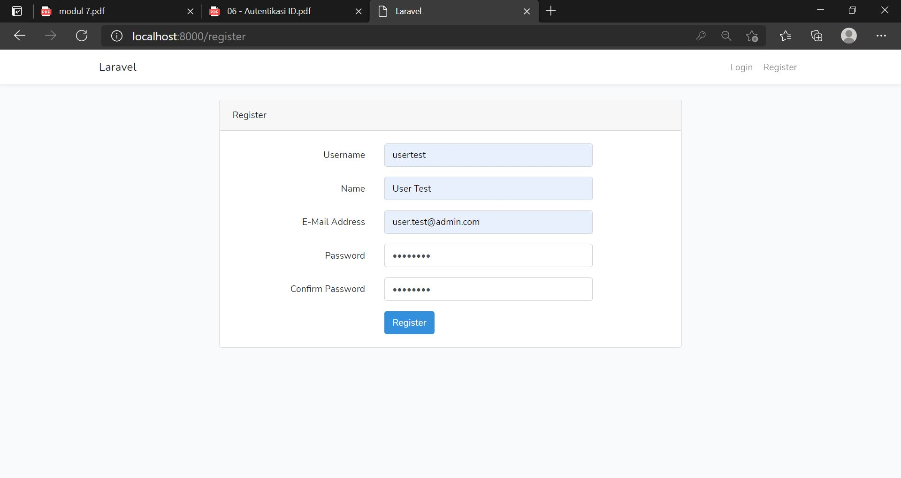
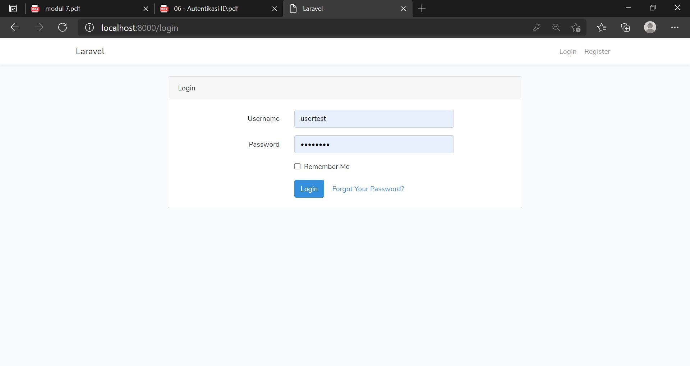

# 02 - Layout

## Tujuan Pembelajaran

1. Mahasiswa mampu memahami konsep authentication
2. Mahasiswa mampu membuat custom authentication

## Praktikum 1

[kode program]()

## Praktikum 2

[kode program](../../src/06_autentikasi/UserSeeder.php)

## Praktikum 3

[kode program](../../src/06_autentikasi/2021_03_25_061114_tambah_kolom_di_tabel_user.php)

[kode program](../../src/06_autentikasi/UserBaruSeeder.php)

[kode program](../../src/06_autentikasi/LoginController.php)

[kode program](../../src/06_autentikasi/UserBaruSeeder.php)

[kode program](../../src/06_autentikasi/login.blade.php)

[kode program](../../src/06_autentikasi/RegisterController.php)

[kode program](../../src/06_autentikasi/register.blade.php)

[kode program](../../src/06_autentikasi/home.blade.php)

[kode program](../../src/06_autentikasi/HomeController.php)
