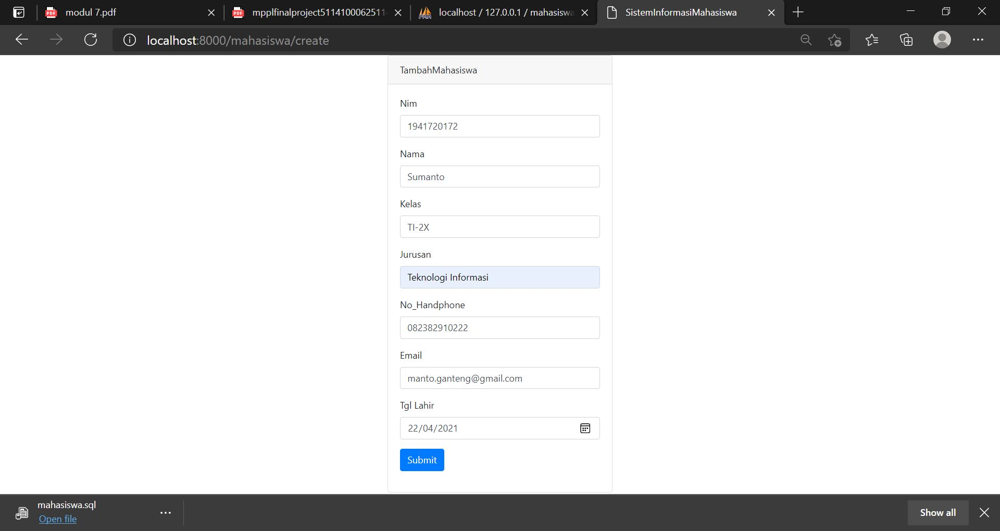

# 07 - ORM ELOQUENT dan CRUD

## Tujuan Pembelajaran

1. Mahasiswa mampu memahami konsep ORM
2. Mahasiswa mampu melakukan operasi CRUD dengan ORM

## Hasil Praktikum

- Halaman Awal

- Input Mahasiswa

- Edit Mahasiswa

- Detail Mahasiswa

## Tugas

