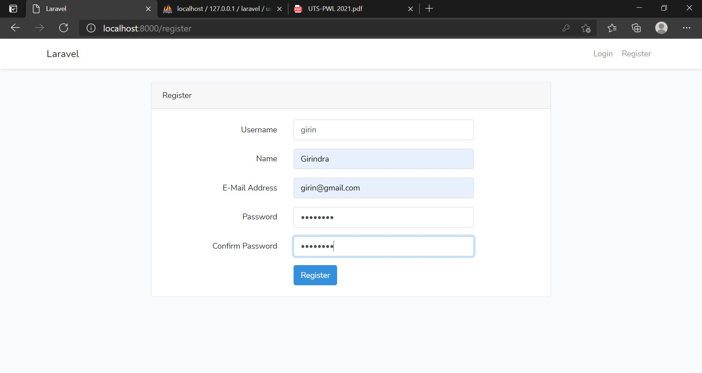
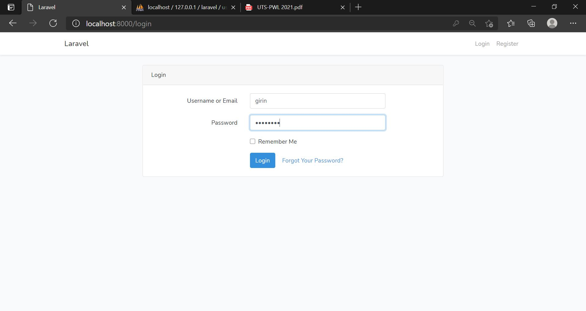
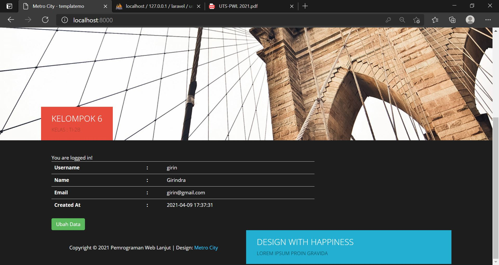
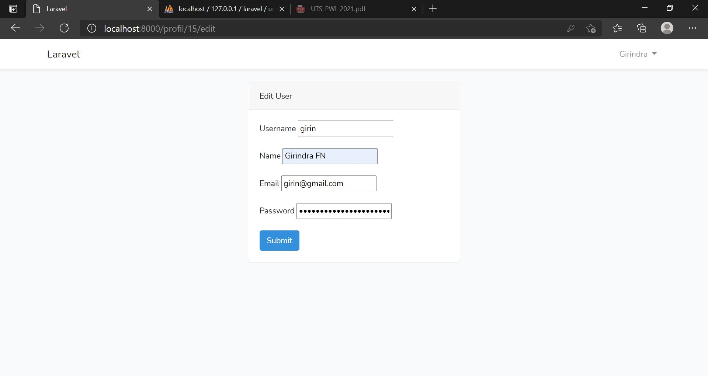
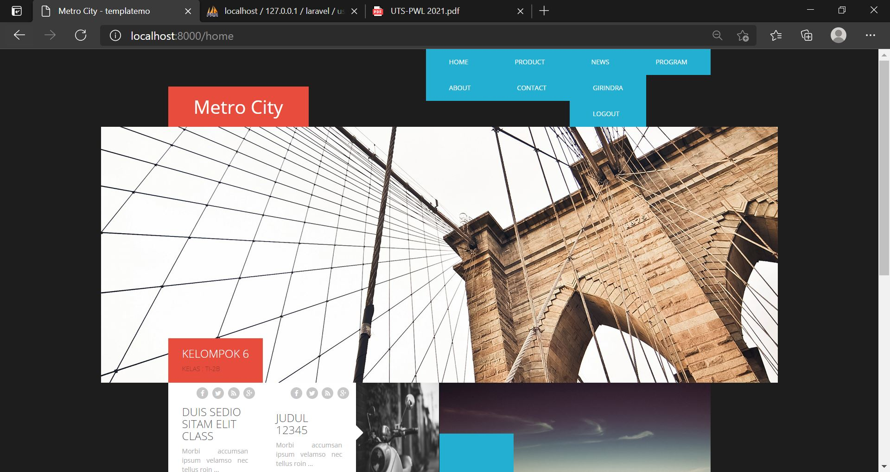

# 08 - UTS

## Tujuan Pembelajaran

1. Mahasiswa mampu menerapkan materi selama perkuliahan.

## Hasil UTS

SCREENSHOT

- Register

- Login

- Dashboard

- Edit Profil

- Home

CONTOH KODE PROGRAM  

[kode program](../../src/08_uts/web.php)

[kode program](../../src/08_uts/about.blade.php)

[kode program](../../src/08_uts/AboutController.php)

[kode program](../../src/08_uts/app.blade.php)

[kode program](../../src/08_uts/app2.blade.php)

[kode program](../../src/08_uts/ArticleController.php)

[kode program](../../src/08_uts/contact.blade.php)

[kode program](../../src/08_uts/ContactController.php)

[kode program](../../src/08_uts/home.blade.php)

[kode program](../../src/08_uts/homee.blade.php)

[kode program](../../src/08_uts/HomeController.php)

[kode program](../../src/08_uts/HomeController2.php)

[kode program](../../src/08_uts/user.php)