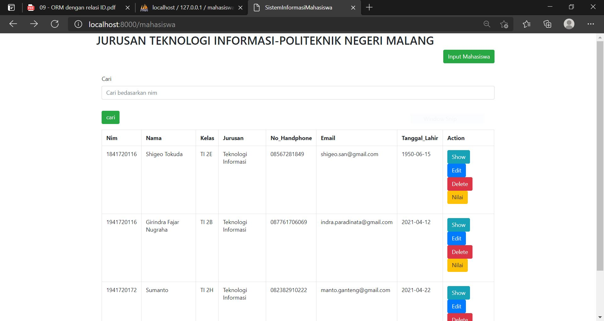
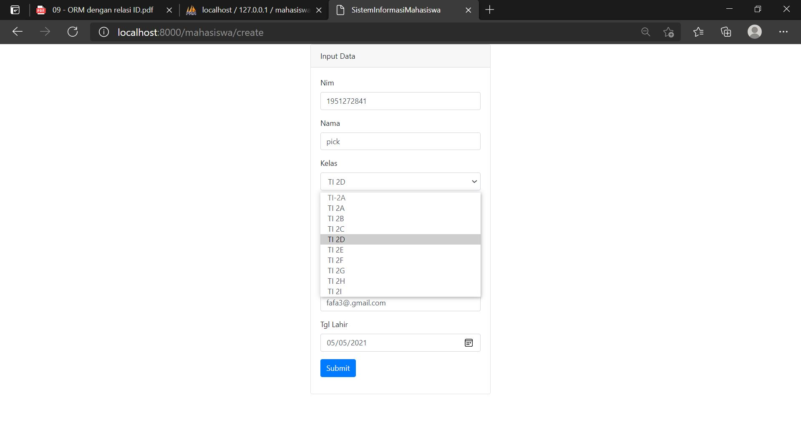
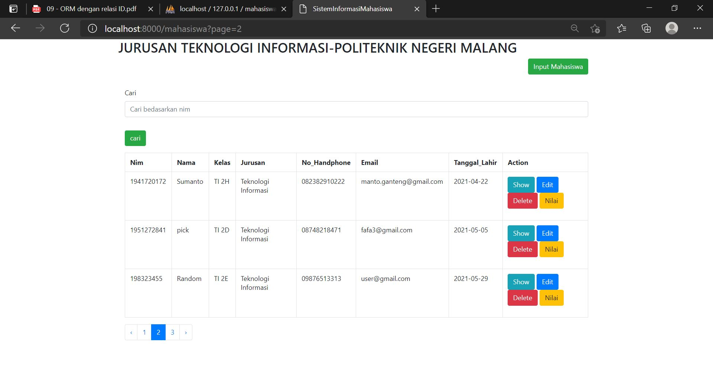

# 09 - ORM dengan Relasi

## Tujuan Pembelajaran

1. Mahasiswa mampu memahami konsep ORM dengan relasi authentication
2. Mahasiswa mampu mengimplementasikan ORM dengan relasi

## Hasil 

SCREENSHOT

- Halaman Awal

- Tambah Mahasiswa
   

- Edit Biodata

CONTOH KODE PROGRAM  

[kode program](../../src/09_orm_dengan_relasi/create.blade.php)

[kode program](../../src/09_orm_dengan_relasi/detail.blade.php)

[kode program](../../src/09_orm_dengan_relasi/edit.blade.php)

[kode program](../../src/09_orm_dengan_relasi/index.blade.php)

[kode program](../../src/09_orm_dengan_relasi/Mahasiswa.php)

[kode program](../../src/09_orm_dengan_relasi/MahasiswaController.php)

[kode program](../../src/09_orm_dengan_relasi/MataKuliah.php)

[kode program](../../src/09_orm_dengan_relasi/MataKuliahSeeders.php)