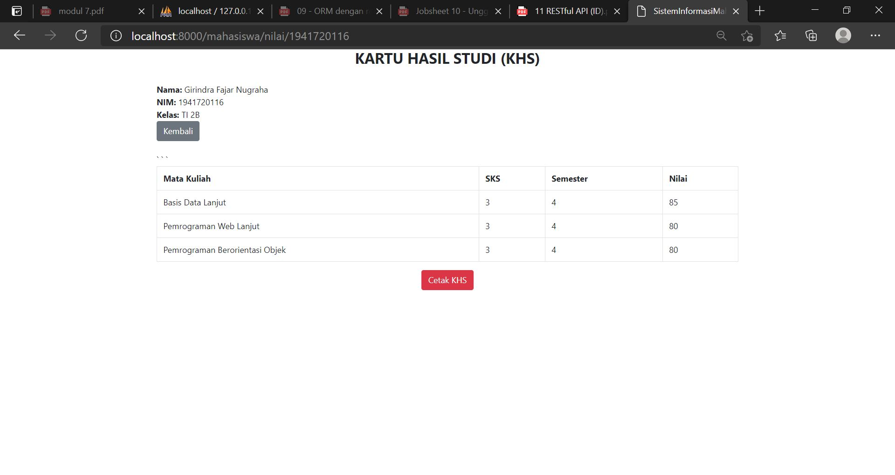

# 10 - Upload dan Eksport

## Tujuan Pembelajaran

1. Mahasiswa mampu membuat fitur unggah file dengan Web Framework Laravel
2. Mahasiswa mampu membangun fitur pelaporan berupa export file PDF

## Hasil Praktikum

Praktikum 

- Create Article

Tugas

- Index

- Nilai KHS
