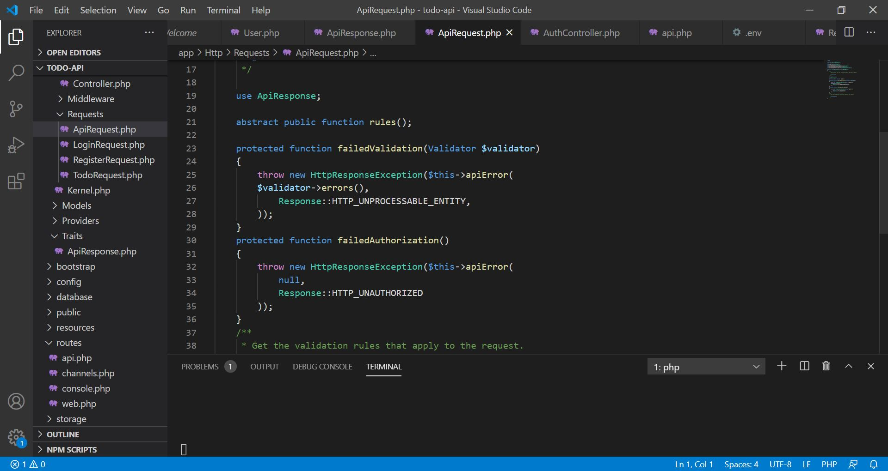
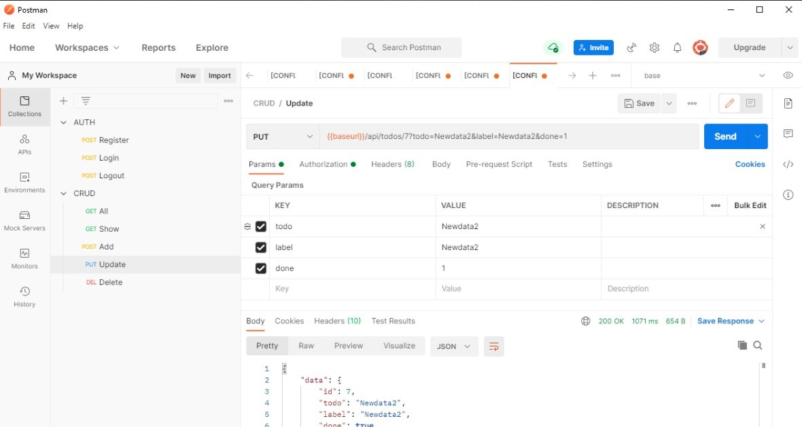

# 11 - RESTful API

## Tujuan Pembelajaran

1. Mahasiswa memahami konsep RESTful API
2. Mahasiswa mampu membangun autentikasi token pada RESTful API
3. Mahasiswa mampu membangun CRUD dengan RESTful aPI

## Hasil Praktikum

Koneksi Database

ApiResponse

ApiRequest

AuthController

RegisterRequest

LoginRequest

AuthController

Register

Login

LogOut

Api

TodosTable

Todo

TodoRequest

Add

Show

Update

Delete

TodoController

